## Object model background

In git, we have the following structure for an individual commit
with directories and files, labeled with name/object-type:

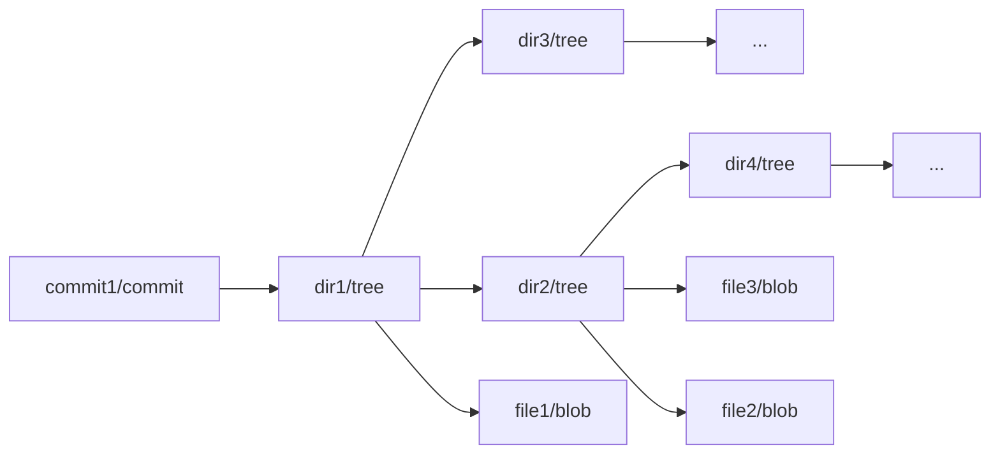

In bup this model is extended, so you could have e.g. a large file ("file2") getting split

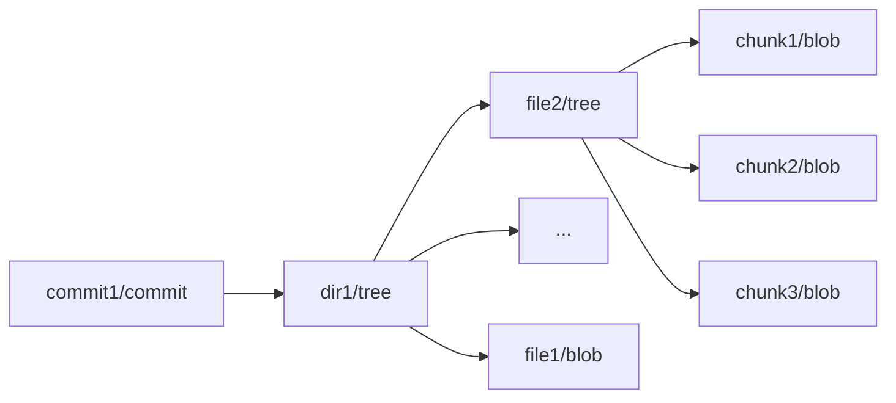

It could also get split into multiple levels:

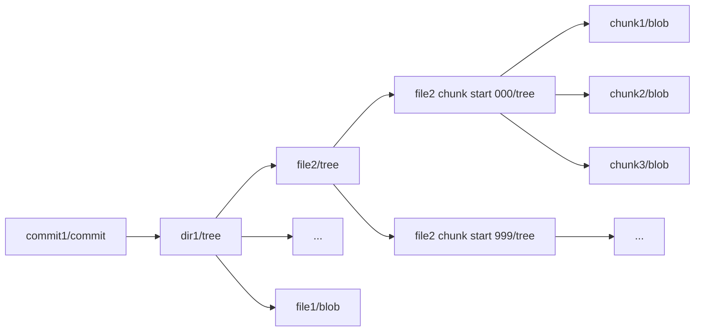

There are some more details (especially with split-trees), but regardless of this, the git model holds conceptually:

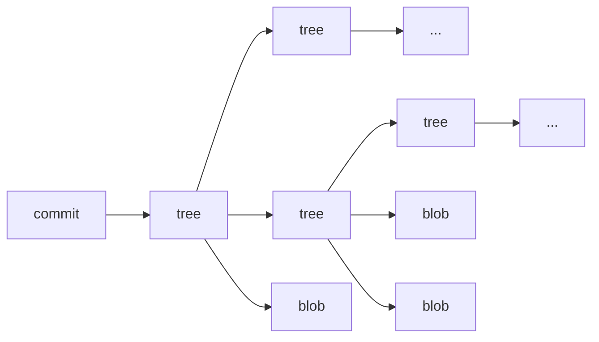

 * commits can point to zero or more other commits
 * commits point to exactly one tree
 * trees can point to other trees and/or blobs

Each object is identified by its content hash.

NOTE: For the sake of simplicity I'm drawing everything as trees in this document. In reality, the bup deduplication works exactly because it is _not_ a tree, but rather a directed acyclic graph (DAG). Multiple backup commits that record unchanged or otherwise identical directories or files obviously point to the object(s) representing those, shared across them.

## How `bup save` operates

When reading files and directories on the filesystem, `bup save` will create a
number of blob and tree objects, store them into the repository if not
already present, and (usually) finally create a new commit object that
points to the previous commit object and the new root tree object.

Each file saved into the repository is uniquely identified by the hash (SHA-1)
of its object, which in bup might be a blob or tree object. In case of
a tree object, the file really consists of a set of objects, unlike in
git.

After reading a file or directory, `bup save` also updates the `index` for it with its hash. This
helps speed up the next time `bup save` runs: if the file is unchanged during the next `bup index`
run, the next `bup save` run can simply check if the object with the hash recorded in the index
is present in the repository, and doesn't have to open/read the file or directory again if this
is the case.

## How `bup get` operates

Conceptually, `bup get` simply walks over the graph of a set of objects
in the source repository, checks if the object is present in the
destination repository, and if not then it copies the object over.
If it encounters a tree object that is already present in the destination
repository, it does _not_ walk down that object, for performance
reasons.

## How `bup prune-older`/`bup rm` operate

Again conceptually, this works by cutting pieces out of the chain of
commits, for example cutting out `commit2`:

### Before

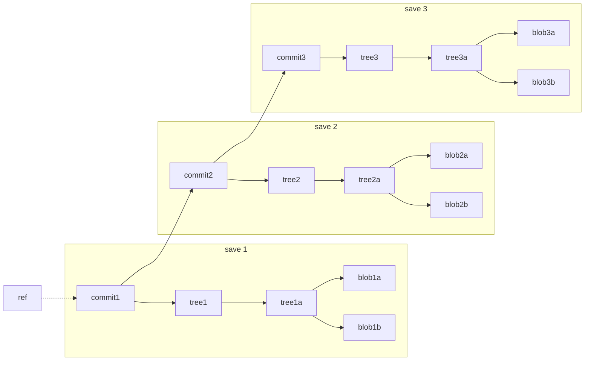

### After

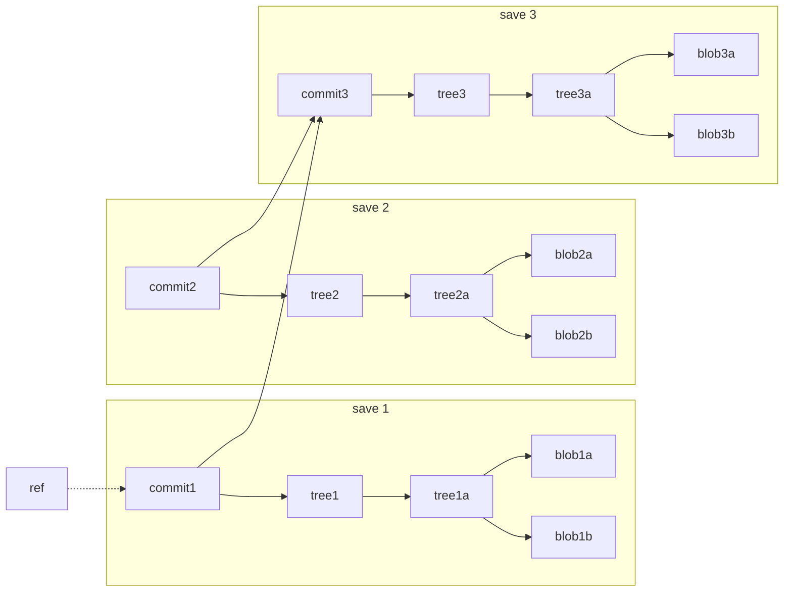

As you can see, the `commit2` object as well as trees/blobs it points to
still exists in the repository.

Technically, this still isn't quite right. Instead, `ref` now points to `commit1'` (a rewritten version of `commit1`) which points to `commit3` and `tree1`, while `commit1` also still exists in the repository pointing to `commit2` and `tree1`. However, the difference between `commit1` and `commit1'` isn't all that relevant to this explanation since commit objects contain timestamps etc. and will never re-appear in any form, so I'm ignoring that to make the pictures more readable.

## How `bup gc` operates

GC is intended to clean up those dangling objects. So after the prune example
above, ideally we want to have in the repository only this left after GC:

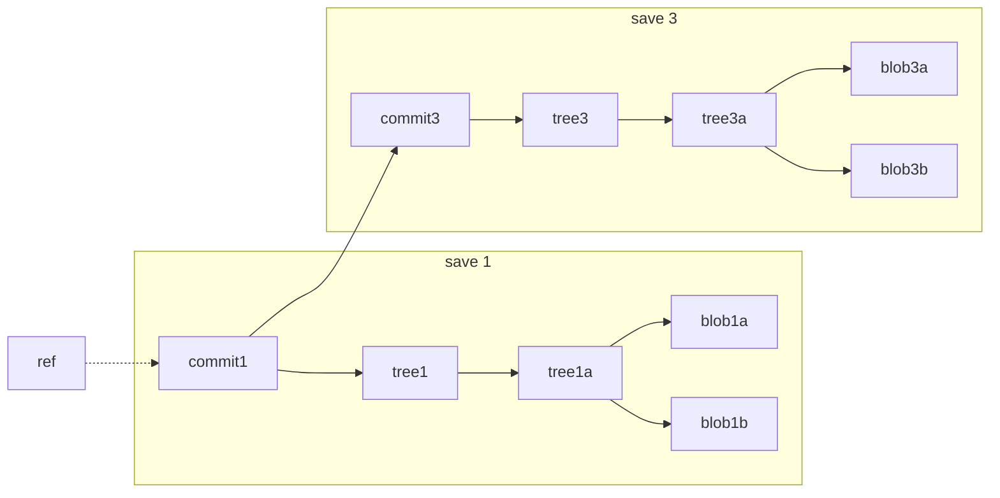

This is not exactly what happens, unfortunately. We're still doing some
background, so more on this later.

## Object existence checking

In order to check if objects already exist in the repository, bup uses
three different data structures:

### `*.idx` files

For each pack file, git and bup use an idx file that contains a list of all
the objects in the pack file, and also points to the object inside the
pack, so you can retrieve a desired object. Checking for existence just
requires seeing if the object name is in the list.

These files can be recreated from the pack files, but this is expensive.

### `*.midx` files

The midx files have a similar structure, except they cover multiple pack
files and tell you which pack file an object is located in (but not
where in that pack file).

These files are created from the `*.idx` files and are ephemeral, they can
be destroyed and recreated at will.

### Bloom filter

To see if it's even worth checking, bup uses a bloom filter (`bup.bloom`), which is a
probabilistic data structure that can say "I've never heard about this
object before" and "I might have seen this object before". If it says
the object doesn't exist, there's no need to check the midx/idx. If it
says the object _might_ exist, the `*.midx`/`*.idx` files need to be
consulted. The bloom filter is therefore not relevant to the issues at
hand.

Just like the `*.midx` files, this file is created from the `*.idx` files
(or perhaps from the `*.midx` that in turn come from `*.idx`) and is also
ephemeral, they can be destroyed and recreated at will.

## Remote save - `bup save -r`

In order to avoid transferring a lot of data that might not be needed,
bup clients synchronize the idx files with the idx files on the server
when connecting. They then rebuild midx/bloom files, and then the save
can do a local "does this object exist already" check, rather than either
shipping the object to the server for it to check, or asking the server
to check, both of which would take a lot of time (due to bandwidth and
latency respectively.)

## Bug #1

When GC is done on a repository, of course some pack files will be
removed along with their idx files.

When a client synchronizes the idx files, it deletes the idx files
from the cache that were removed on the server repository, so that
testing for objects that were previously contained in them should no
longer indicate that they already exist. (It also downloads idx files
that it doesn't have, to have the updated information.)

However, the midx files are incorrectly updated. Remember that
midx files are created from the idx files. When updating the midx
files after the idx synchronization, bup doesn't check whether or
not any of the midx file(s) still contain(s) content from a now-deleted
idx file. This can lead to checking for object existence and being
given the answer that an object exists, even though it was GC'ed in
the repository, and in fact the idx files no longer show that it
exists, only the incorrect midx does.

This in turn can lead to save -r or get -r omitting an object that had
previously existed, but has been removed by GC on the remote (omitted
because the midx still thinks the remote has it).

This doesn't happen with local use of the repository (without -r or 'bup on')
since gc removes all midx/bloom files.

## Bug #2

I previously showed that after prune, you have this set of objects
in the repository:

Remember that after GC, we want this set of objects:

Unfortunately, the current GC fundamentally doesn't work that way (and that's the issue),
and it might remove only

 * `commit2`
 * `tree2`
 * `blob2b`

and therefore create the following situation:

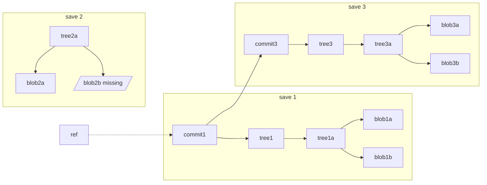

### How does that happen?

There are actually two reasons it can do this:

#### Probabilistic liveness detection

The first reason is that gc tracks live objects only
probabilistically, not precisely. It treats objects as live
when they are in a bloom filter of live objects, populated
by a reachability walk through all refs.

Because bloom filters can only say "definitely not present"
and "maybe present", it means that a random other object
can cause `tree2a` to be considered "maybe present" and that
means 'live' in the gc implementation.

First, the bloom filter is populated with live objects, each bit of the hash of all live objects is set to 1:

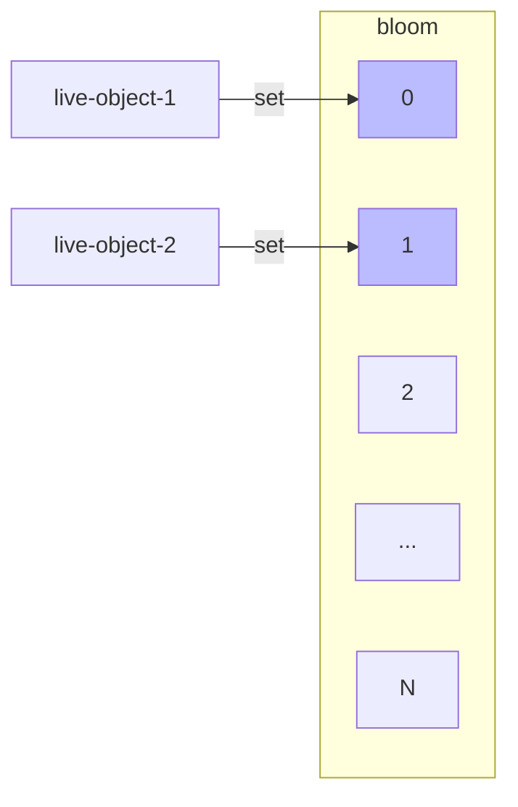

Then the liveness check can erroneously return that the object is live if it maps to the same bit as a live object:

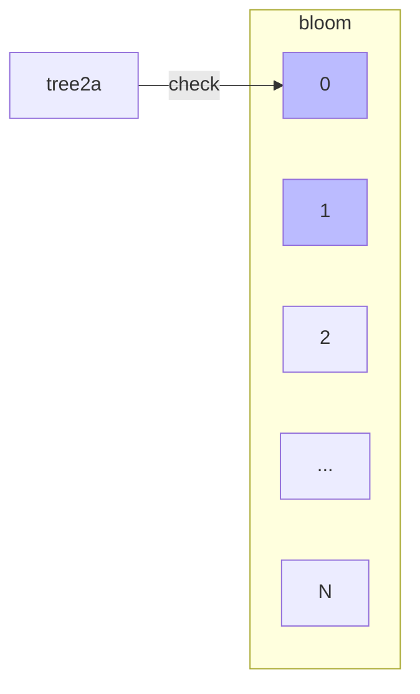

#### Pack file rewrite threshold

Alternatively (or additionally), it's possible that `tree2a`
and `blob2b` are part of two different pack files (depending
on how/when they were written), and the pack file containing
`blob2b` ends up being rewritten (because it has more dead
objects than the threshold), but the pack file containing
`tree2a` is not rewritten (because it doesn't.)

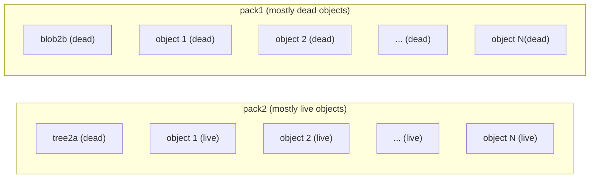

### Effect on `bup get`

If you run `bup get` now to write to this repository, and it encounters
`tree2a` in the set of objects to transfer, it will see that it
already exists, and as explained earlier, will not walk into it. This
will leave the repository broken, because now get created a new
reference to `tree2a`, but `blob2b` is missing:

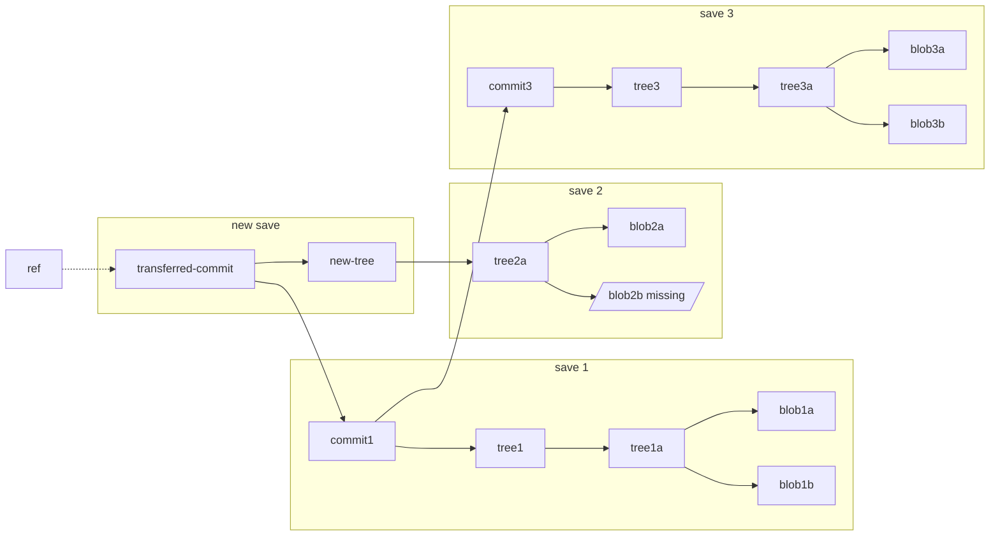

### Effect on `bup save`

Similarly, if `bup save` encounters `tree2a` in the `index`, and sees
that it already exists in the repository, it will not read the file.
Again, it creates a new reference to `tree2a` despite `blob2b` being
missing, exactly as in the previous graph.

This can (also) happen if a save was aborted in the middle, and then
gc was run to clean up the repo and remove unreferenced objects, but
some objects that were already referenced by the index (e.g. `tree2a`)
were not removed by gc, while some objects pointed to by those
referenced in the index (e.g. `blob2b`) were removed by gc.

However, if the index was destroyed it should not be possible for
`bup save` to create this situation, since to save a file it will
create each individual object the file is comprised of and check
if that exists in the repository. This would encounter `blob2b`
and store the missing object again, even though next it calculates
`tree2a`, which already exists and doesn't need to be saved again.

## Bug #3

While working on all of this, we noticed that a similar scenario as
with `bup gc` can occur with just `bup get` in case it is aborted
during the transfer.

Starting with the usual test repository from the explanations and
examples above:

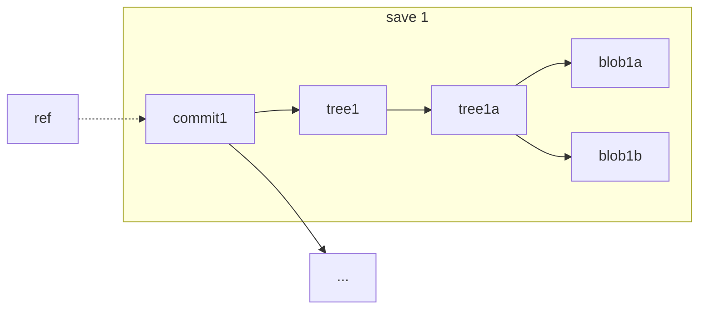

Say that `bup get` is called to transfer `commit1` from
this to another repository. For simplicity let's assume not
its parent commit (`...`), perhaps to a repository that
already has it.

This should transfer the following objects:
 * `commit1`
 * `tree1`
 * `tree1a`
 * `blob1a`
 * `blob1b`

Unfortunately, current versions of `bup get` will transfer
the objects in precisely the listed order. This means that
`bup get` can be aborted in just the wrong place, say after
`blob1a`, and leave `tree1a` in the destination repo, but
with `blob1b` missing. A future `bup get` won't even repair (resume)
this, because (as described previously) it will see `tree1a` in
the destination repository and not check further into it.

(For example, `bup get` could be aborted because of running out
of disk space on the destination, network connections dying, etc.)

NOTE: If you were to run `bup gc` after the aborted transfer even the
broken version of it would clean up the freshly written pack file
since the objects aren't connected yet, but chances are that one would
just attempt to resume the transfer, resulting in it being connected,
but potentially incomplete. Also, due to its own bloom collision bug,
gc might keep wrong objects.
